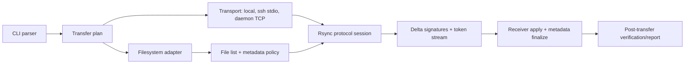

# Native Windows Rsync Implementation Plan

> **For agentic workers:** REQUIRED: Use superpowers:subagent-driven-development (if subagents available) or superpowers:executing-plans to implement this plan. Steps use checkbox (`- [ ]`) syntax for tracking.

**Goal:** Build a Windows-native rsync-compatible command line application that can interoperate with Linux and macOS rsync over remote-shell and daemon transports without depending on Cygwin/MSYS POSIX emulation at runtime.

**Architecture:** Use a clean-room Rust implementation of the rsync wire protocol, delta algorithm, and CLI compatibility surface. Keep Windows filesystem semantics behind a native adapter that exposes an explicit POSIX-compatible view plus a separate NTFS-preserving mode for Windows-only fidelity.

**Tech Stack:** Rust workspace, `windows` crate for Win32/NTFS APIs, `tokio` or blocking stdio/TCP transports, `clap` for CLI parsing, checksum/compression crates selected to match negotiated rsync capabilities, PowerShell/OpenSSH for integration tests.

---

## Current Repository State

`F:\files\workspace\rsync-win` is currently empty and is not a Git repository. There are no existing source files, build files, tests, or module boundaries to preserve.

This plan therefore assumes a greenfield project.

## Research Conclusions

### Core Compatibility Facts

- Upstream rsync defines protocol version bounds and TCP daemon port `873`.
- Compatibility requires implementing the rsync wire protocol, not just the rolling checksum algorithm.
- `librsync` is useful as an algorithm reference but explicitly is not wire-compatible with rsync.
- The first transport to implement should be remote-shell mode, because it is the common path for Linux/macOS interoperability: local process launches remote `rsync --server ...` over SSH and then exchanges protocol bytes over stdin/stdout.
- Daemon mode is a second transport with a separate greeting, module selection, optional auth, MOTD/listing behavior, and then the normal rsync protocol over TCP.
- Windows-native behavior must not pretend NTFS is POSIX. ACLs, SIDs, reparse points, alternate data streams, long paths, case-insensitivity, Unicode normalization, creation time, and locked-file consistency all need explicit policy.

### Compatibility Target

The implementation should expose three metadata policy modes:

- `portable`: ordinary files, directories, symlinks where possible, hardlinks where possible, size, mtime, deletion, filters. This is the default cross-platform mode.
- `posix`: portable plus POSIX `mode`, uid/gid names or numeric ids, POSIX ACL/xattr where the peer supports them. On Windows, this is a best-effort compatibility view, not NTFS security fidelity.
- `ntfs-native`: Windows-only preservation of security descriptors, ADS, reparse tags, Windows attributes, sparse/compressed/encrypted state, and optional VSS snapshot reads. This should be implemented as sidecar metadata or a native extension, not as standard rsync protocol behavior.

### Initial Protocol Scope

MVP should negotiate and interoperate with these peers:

- Upstream Linux rsync-compatible peers using modern protocol versions.
- Homebrew/macOS rsync-compatible peers using their advertised protocol versions.
- macOS stock rsync/openrsync compatibility as a later test target, because built-in macOS versions are fragmented and often support only older protocol/option subsets.

Recommended order:

1. Protocol 31/32 happy path with remote-shell transport.
2. Protocol 30 compatibility for broader Linux/macOS rsync-compatible peers.
3. Protocol 29/27 compatibility only for explicitly scoped options and tests.
4. Daemon mode after remote-shell is stable.

## Architecture

### Workspace Layout

- Create: `Cargo.toml`
  Root workspace manifest.

- Create: `crates/rsync-cli/src/main.rs`
  CLI entry point, option parsing, command mode dispatch, exit codes.

- Create: `crates/rsync-core/src/lib.rs`
  Shared domain types, errors, feature flags, metadata policy model.

- Create: `crates/rsync-protocol/src/lib.rs`
  Wire protocol primitives, integer/string encoding, multiplexed messages, protocol version negotiation.

- Create: `crates/rsync-delta/src/lib.rs`
  Rolling checksum, strong checksum abstraction, block signatures, token stream generation and application.

- Create: `crates/rsync-fs/src/lib.rs`
  Platform-neutral filesystem trait and metadata model.

- Create: `crates/rsync-winfs/src/lib.rs`
  Windows filesystem adapter using native Win32 APIs.

- Create: `crates/rsync-transport/src/lib.rs`
  Local stdio, SSH subprocess stdio, and daemon TCP transports.

- Create: `crates/rsync-filter/src/lib.rs`
  Include/exclude/filter rule parser and matcher.

- Create: `tests/interop/`
  End-to-end tests that run against real `rsync` binaries when available.

### Runtime Data Flow

### Windows Filesystem Mapping

| Windows feature | Standard rsync mapping | Design decision |
| --- | --- | --- |
| Long paths | Not protocol-visible | Use Unicode APIs and long-path-aware manifest; normalize only for local access. |
| Case-insensitive names | Protocol has path bytes/names | Preflight casefold collision detection before writing. |
| Reserved names/chars | Not POSIX-compatible | Reject by default, optionally mangle with explicit user policy. |
| NTFS ACL/security descriptor | Not equivalent to POSIX ACL | Ignore in `portable`; sidecar/hash in `ntfs-native`; never silently claim POSIX fidelity. |
| Symlink | `--links`, `--copy-links`, safe/unsafe links | Model symlink files/dirs separately from junctions and mount points. |
| Junction/reparse point | No exact POSIX equivalent | Do not traverse by default; preserve only in `ntfs-native`. |
| Hardlink | `--hard-links` | Track by volume serial + file id; fail or degrade across volumes. |
| Creation time | `--crtimes` where supported | Expose only when negotiated or in native metadata sidecar. |
| ADS | Not normal xattr | Preserve only in `ntfs-native` via stream enumeration/sidecar. |
| Locked files | Outside rsync protocol | Add optional VSS source snapshot mode after basic protocol works. |

## Design Decisions

1. Build a native implementation, not a packaged Cygwin/MSYS rsync.

   Reason: Cygwin/MSYS already solve POSIX emulation but do not meet the goal of a native Windows app. The native implementation must own Windows path, ACL, symlink, and stream behavior instead of inheriting emulation choices.

2. Do not use `librsync` as the protocol engine.

   Reason: `librsync` implements the remote-delta algorithm, but it is not rsync wire-compatible. It can inform delta tests, not replace protocol work.

3. Start with remote-shell client/server before daemon mode.

   Reason: SSH remote-shell mode is the dominant interoperability path and exercises the core protocol without daemon module/auth complexity.

4. Treat metadata preservation as a capability report.

   Reason: POSIX and NTFS metadata are not losslessly equivalent. Every transfer should know which requested attributes were applied, stored as sidecar, ignored, or rejected.

5. Prefer correctness over broad option count in MVP.

   Reason: A small compatible subset with good interop tests is more useful than a large CLI surface that corrupts metadata or misrepresents behavior.

## Implementation Chunks

## Chunk 1: Project Skeleton and Test Harness

### Task 1: Initialize Rust Workspace

**Files:**
- Create: `Cargo.toml`
- Create: `crates/rsync-cli/Cargo.toml`
- Create: `crates/rsync-cli/src/main.rs`
- Create: `crates/rsync-core/Cargo.toml`
- Create: `crates/rsync-core/src/lib.rs`

- [ ] Create the workspace manifests and placeholder crates.
- [ ] Add `clap`, `thiserror`, and `anyhow` only where needed.
- [ ] Implement `rsync-win --version` with app version and supported protocol placeholder.
- [ ] Run `cargo test --workspace`.
- [ ] Commit: `chore: initialize rust workspace`

### Task 2: Add Interop Test Discovery

**Files:**
- Create: `tests/interop/rsync_discovery.rs`
- Create: `tests/common/mod.rs`

- [ ] Write helper to discover local `rsync`, `ssh`, and PowerShell availability.
- [ ] Tests should skip with a clear message when external binaries are unavailable.
- [ ] Add fixture temp directory creation and cleanup helpers.
- [ ] Run `cargo test --workspace`.
- [ ] Commit: `test: add interop discovery harness`

## Chunk 2: Protocol and Delta Primitives

### Task 3: Wire Encoding

**Files:**
- Create: `crates/rsync-protocol/Cargo.toml`
- Create: `crates/rsync-protocol/src/lib.rs`
- Create: `crates/rsync-protocol/src/io.rs`
- Create: `crates/rsync-protocol/src/version.rs`

- [ ] Implement little-endian integer reads/writes used by rsync.
- [ ] Implement protocol version exchange with local max/min constants.
- [ ] Add tests for valid negotiation, old peer, future peer, and invalid peer.
- [ ] Run `cargo test -p rsync-protocol`.
- [ ] Commit: `feat: add rsync protocol version negotiation`

### Task 4: Rolling Checksum and Strong Checksum Abstraction

**Files:**
- Create: `crates/rsync-delta/Cargo.toml`
- Create: `crates/rsync-delta/src/lib.rs`
- Create: `crates/rsync-delta/src/rollsum.rs`
- Create: `crates/rsync-delta/src/signature.rs`

- [ ] Implement rsync-style 32-bit rolling checksum.
- [ ] Add block signature generation with configurable block size.
- [ ] Add strong checksum trait with MD4/MD5 placeholders wired through feature flags.
- [ ] Add deterministic unit tests using small byte arrays and shifted content.
- [ ] Run `cargo test -p rsync-delta`.
- [ ] Commit: `feat: add rolling checksum signatures`

### Task 5: Token Stream Generation

**Files:**
- Modify: `crates/rsync-delta/src/lib.rs`
- Create: `crates/rsync-delta/src/matcher.rs`
- Create: `crates/rsync-delta/src/apply.rs`

- [ ] Implement literal/copy token generation from source bytes and receiver signatures.
- [ ] Implement token application to reconstruct the output.
- [ ] Add tests for insert, delete, move, empty receiver, and identical file cases.
- [ ] Run `cargo test -p rsync-delta`.
- [ ] Commit: `feat: add delta token matching and apply`

## Chunk 3: Filesystem Model

### Task 6: Portable Metadata Model

**Files:**
- Create: `crates/rsync-fs/Cargo.toml`
- Create: `crates/rsync-fs/src/lib.rs`
- Create: `crates/rsync-fs/src/metadata.rs`
- Create: `crates/rsync-fs/src/walk.rs`

- [ ] Define `FileType`, `PortableMetadata`, `MetadataPolicy`, and degradation report types.
- [ ] Define filesystem trait for walk, read, write temp file, rename, set mtime, create symlink, create hardlink.
- [ ] Add in-memory test filesystem for protocol-independent tests.
- [ ] Run `cargo test -p rsync-fs`.
- [ ] Commit: `feat: define portable filesystem model`

### Task 7: Native Windows Filesystem Adapter

**Files:**
- Create: `crates/rsync-winfs/Cargo.toml`
- Create: `crates/rsync-winfs/src/lib.rs`
- Create: `crates/rsync-winfs/src/path.rs`
- Create: `crates/rsync-winfs/src/metadata.rs`
- Create: `crates/rsync-winfs/src/links.rs`

- [ ] Implement long-path-safe path conversion using Windows Unicode APIs.
- [ ] Implement metadata read for file type, size, mtime, creation time, attributes, file id, volume serial, and reparse tag.
- [ ] Implement preflight collision checks for casefold and invalid Windows target names.
- [ ] Implement symlink and hardlink creation behind explicit capability checks.
- [ ] Run Windows-only unit tests on temp directories.
- [ ] Commit: `feat: add native windows filesystem adapter`

## Chunk 4: Remote-Shell Interop

### Task 8: Transport Abstraction

**Files:**
- Create: `crates/rsync-transport/Cargo.toml`
- Create: `crates/rsync-transport/src/lib.rs`
- Create: `crates/rsync-transport/src/process.rs`
- Create: `crates/rsync-transport/src/tcp.rs`

- [ ] Define bidirectional byte stream trait.
- [ ] Implement local child process transport for `ssh host rsync --server ...`.
- [ ] Implement TCP transport placeholder for daemon mode.
- [ ] Add tests using a local echo child process.
- [ ] Commit: `feat: add transport abstraction`

### Task 9: Minimal `--server` Session

**Files:**
- Modify: `crates/rsync-cli/src/main.rs`
- Create: `crates/rsync-protocol/src/session.rs`
- Create: `crates/rsync-protocol/src/flist.rs`

- [ ] Parse a minimal subset of client options: `-r`, `-t`, `--delete`, `--dry-run`, `--whole-file`.
- [ ] Generate remote `--server` argv for push and pull.
- [ ] Implement minimal file-list serialization for regular files/directories.
- [ ] Interop test: one small file push to Linux/macOS rsync when available.
- [ ] Interop test: one small file pull from Linux/macOS rsync when available.
- [ ] Commit: `feat: interoperate with rsync remote shell for basic files`

## Chunk 5: Delete, Filter, and Metadata Expansion

### Task 10: Filters

**Files:**
- Create: `crates/rsync-filter/Cargo.toml`
- Create: `crates/rsync-filter/src/lib.rs`
- Create: `crates/rsync-filter/src/rule.rs`

- [ ] Implement include/exclude/filter rule parsing for the MVP subset.
- [ ] Apply rules consistently to sender file list and receiver delete protection.
- [ ] Add tests for anchored rules, directory rules, wildcards, and `--files-from`.
- [ ] Commit: `feat: add filter rule engine`

### Task 11: Metadata Policy Reporting

**Files:**
- Modify: `crates/rsync-core/src/lib.rs`
- Modify: `crates/rsync-fs/src/metadata.rs`
- Modify: `crates/rsync-cli/src/main.rs`

- [ ] Report unsupported metadata requests as structured warnings.
- [ ] Add `--metadata-policy=portable|posix|ntfs-native`.
- [ ] Add `--fail-on-metadata-loss` for backup workflows.
- [ ] Add tests for requested but unsupported ACL/xattr/device/special file behavior.
- [ ] Commit: `feat: add metadata policy reporting`

## Chunk 6: Daemon Mode and Windows-Native Features

### Task 12: Daemon Client

**Files:**
- Modify: `crates/rsync-transport/src/tcp.rs`
- Create: `crates/rsync-protocol/src/daemon.rs`

- [ ] Implement `@RSYNCD` greeting parsing and version/digest-list validation.
- [ ] Implement module list request.
- [ ] Implement module selection and no-auth transfer.
- [ ] Implement password-file auth later, with daemon auth warning.
- [ ] Interop test against a local rsync daemon container or fixture.
- [ ] Commit: `feat: add rsync daemon client handshake`

### Task 13: NTFS Native Metadata Extension

**Files:**
- Modify: `crates/rsync-winfs/src/metadata.rs`
- Create: `crates/rsync-winfs/src/security.rs`
- Create: `crates/rsync-winfs/src/streams.rs`
- Create: `crates/rsync-winfs/src/vss.rs`

- [ ] Enumerate security descriptor and produce stable hash/sidecar representation.
- [ ] Enumerate alternate data streams.
- [ ] Preserve sparse files where requested.
- [ ] Prototype VSS snapshot source reads behind an explicit `--vss` flag.
- [ ] Add Windows integration tests requiring admin privileges only when marked.
- [ ] Commit: `feat: prototype ntfs-native metadata preservation`

## Verification Matrix

Minimum required before calling the first implementation complete:

- `cargo test --workspace`
- Local Windows-to-Windows directory sync with ordinary files, deletion, mtime preservation.
- Windows client pushing to upstream rsync over SSH.
- Windows client pulling from upstream rsync over SSH.
- Windows client pushing to macOS/Homebrew rsync over SSH when available.
- Case-collision preflight test: `Foo` and `foo` from a case-sensitive source to default NTFS must fail before transfer.
- Symlink test with Developer Mode or elevated privilege, plus fallback warning test.
- Long path test with `\\?\` and manifest support.

## Open Questions

- License target: if this repository must be permissively licensed, avoid copying upstream GPL rsync code and keep implementation clean-room.
- Minimum Windows version: long path and symlink behavior should assume Windows 10 1607+ unless the project explicitly targets older systems.
- Async runtime: blocking stdio/TCP may be simpler for MVP; `tokio` can be introduced when multiplexing and daemon concurrency require it.
- macOS stock compatibility: decide whether protocol 27/29 and openrsync option subset are first-class goals or documented best-effort.
- NTFS fidelity format: choose between sidecar files, archive-like metadata stream, or private protocol extension for Windows-to-Windows transfers.

## Sources

- rsync project and latest release: https://rsync.samba.org/
- rsync manpage: https://download.samba.org/pub/rsync/rsync.1
- rsync daemon config manpage: https://download.samba.org/pub/rsync/rsyncd.conf.5
- rsync algorithm technical report: https://rsync.samba.org/tech_report/
- practical rsync architecture overview: https://rsync.samba.org/how-rsync-works.html
- rsync protocol constants: consult upstream rsync source headers for the target compatibility surface.
- librsync project note on wire compatibility: https://librsync.sourceforge.net/
- openrsync implementation notes: https://github.com/kristapsdz/openrsync
- Microsoft long path behavior: https://learn.microsoft.com/en-us/windows/win32/fileio/maximum-file-path-limitation
- Microsoft file times: https://learn.microsoft.com/en-us/windows/win32/sysinfo/file-times
- Microsoft hard links and junctions: https://learn.microsoft.com/en-us/windows/win32/fileio/hard-links-and-junctions
- Microsoft symbolic links: https://learn.microsoft.com/en-us/windows/win32/fileio/symbolic-links
- Microsoft file streams and ADS: https://learn.microsoft.com/en-us/windows/win32/fileio/file-streams
- Microsoft VSS overview: https://learn.microsoft.com/en-us/windows-server/storage/file-server/volume-shadow-copy-service
- Windows case sensitivity: https://learn.microsoft.com/en-us/windows/wsl/case-sensitivity
- Apple APFS normalization notes: https://developer.apple.com/library/archive/documentation/FileManagement/Conceptual/APFS_Guide/FAQ/FAQ.html
- Apple file system programming guide: https://developer.apple.com/library/archive/documentation/FileManagement/Conceptual/FileSystemProgrammingGuide/FileSystemDetails/FileSystemDetails.html
